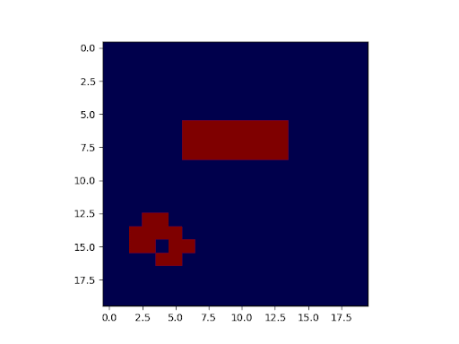
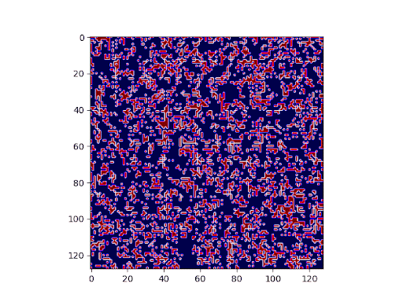

# Conway's Game of Life

## Overview

Conway's Game of Life is a 0-player game taking place on a 2D grid of cells that are either dead or alive. The initial state of the cells determine their evolution. Each cell has 8 neighbors, which are any cell that is diagonally, horizontally, or vertically adjacent to it.

The rules for this game are simple and are applied at each time step:

1. Any living cell with 2 or 3 living neighbors survives
2. Any dead cell with 3 living neighbors becomes living
3. All other living cells die, and all dead cells stay dead

Depending on the initial alive cells, this can lead to some interesting patterns. [Click here](https://en.wikipedia.org/wiki/Conway%27s_Game_of_Life) for more information on types of patterns or the game in general.

## Example Simulations

    <figure style="display: inline-block">
        
        <figcaption style="text-align: center; padding: 10px">20x20 Grid</figcaption>
    </figure>
    <figure style="display: inline-block">
        
        <figcaption style="text-align: center; padding: 10px">130x130 Grid</figcaption>
    </figure>

